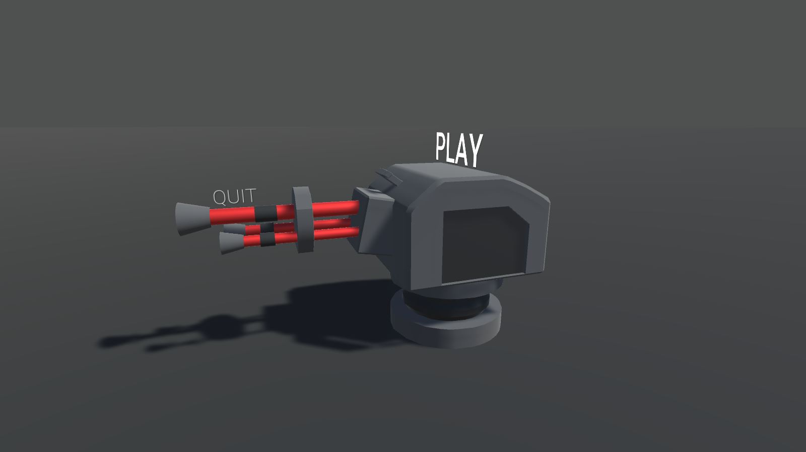
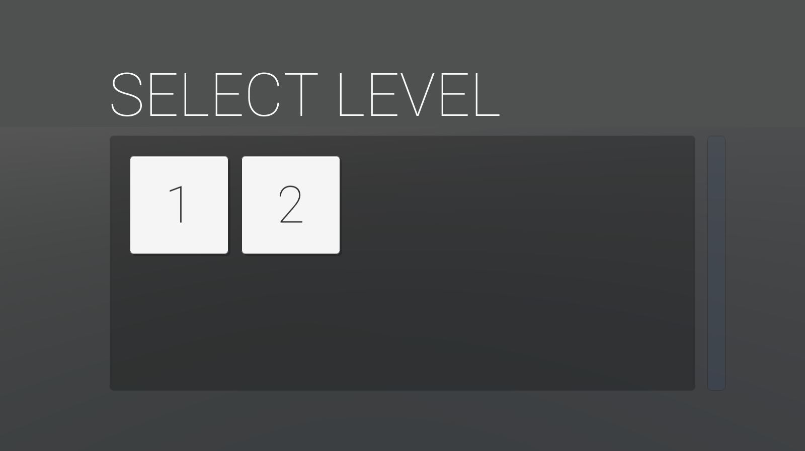
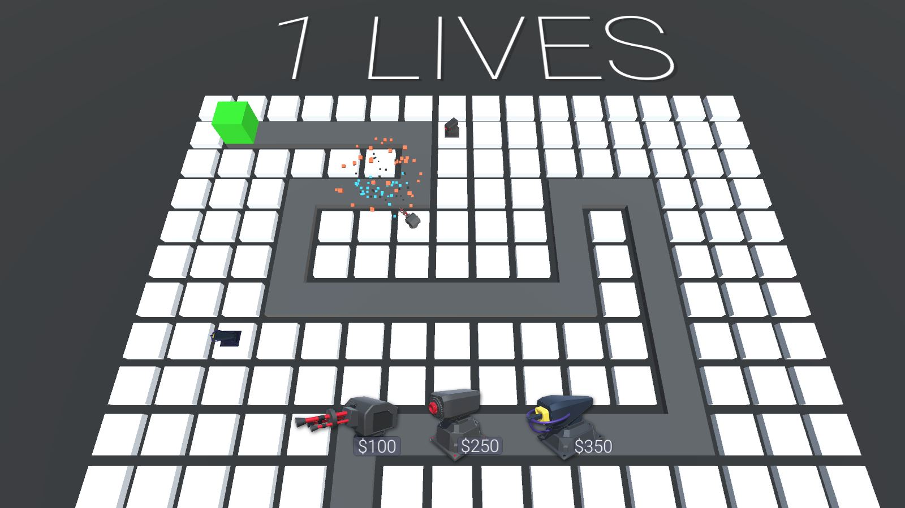
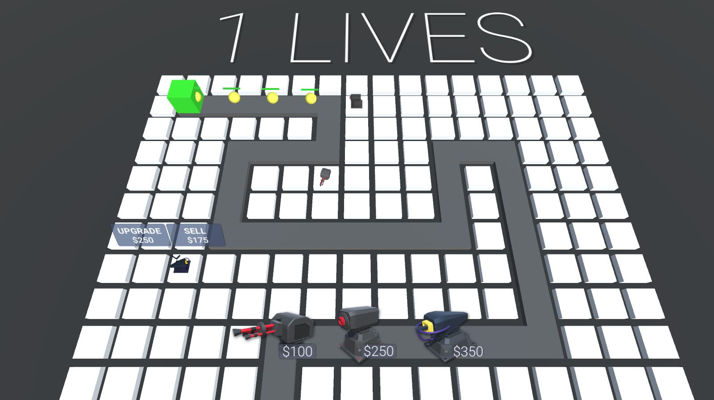
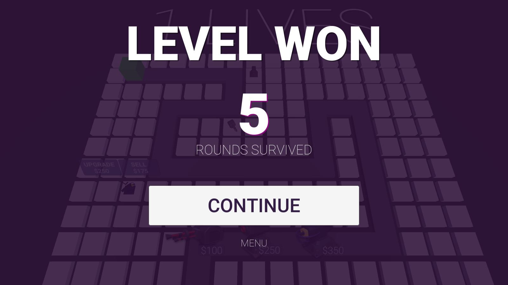
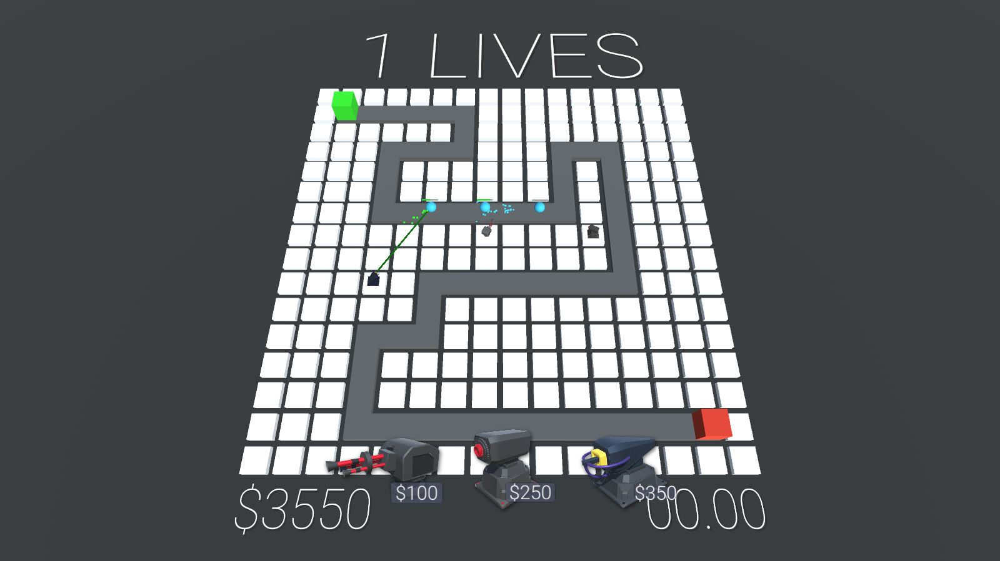
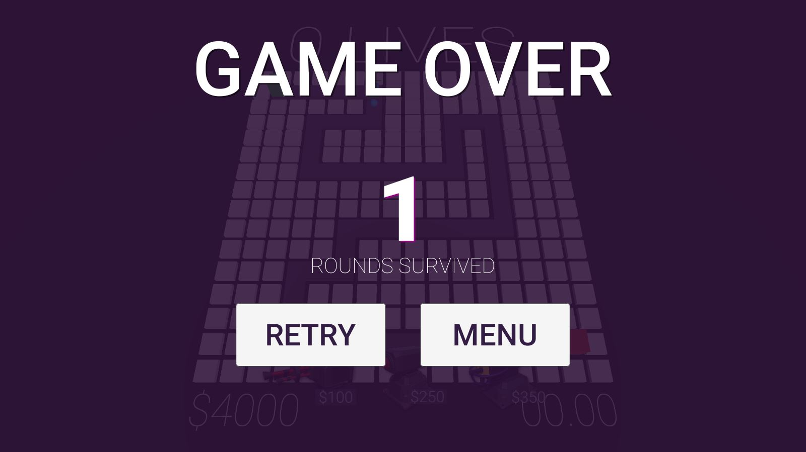

# Tower Defense

[Demo](https://moscaluconstantin.github.io/Tower-Defense/index.html)

## Project review

#### Features

- Enemy AI
- TURRETS
- SHOOTING
- BUILDING
- CAMERA
- SHOP
- MISSILE LAUNCHER
- MISSILES
- CURRENCY
- USER INTERFACE
- LIVES
- LASER BEAMER
- LASER EFFECTS
- SLOWING
- GAME OVER
- SELECTION
- UPGRADE
- SELL
- PAUSE MENU
- MAIN MENU
- HEALTH BARS
- FADING
- WAVE SPAWNER
- LEVEL SELECT
- UNLOCK LEVELS
- WINNING LEVELS

## Commands

- Camera move: move your mouse to one of the screen edges or use (W, A, S, D) keys.
- Camera zoom: use your mouse scroll.
- Camera lock: press the 'C' key.

## Screens

